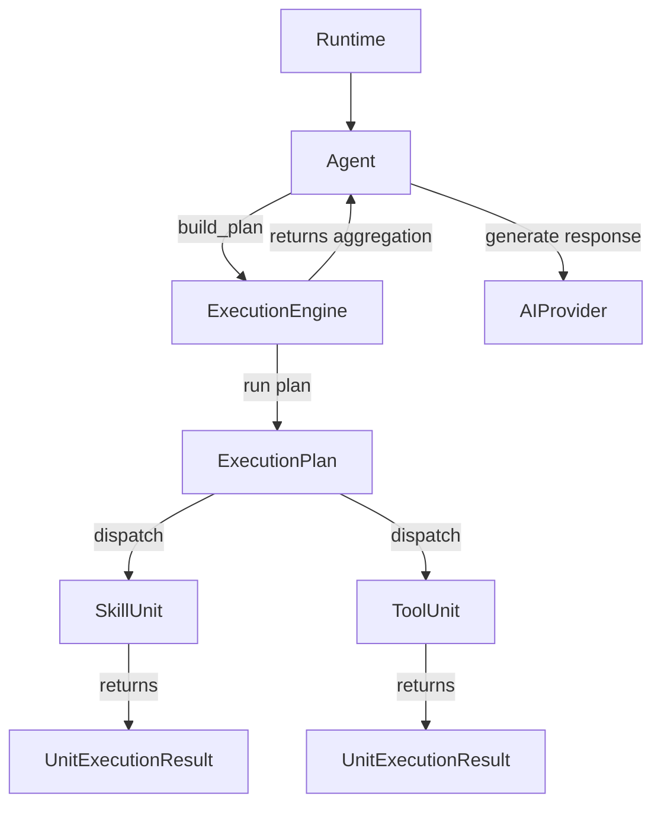

# Execution Engine

The `ExecutionEngine` is the core runtime orchestrator of the Aether framework. It manages the execution lifecycle of tasks, coordinating skills and tools under a unified execution model.

## Responsibility & Role

In Aether, responsibilities are clearly split between identity/reasoning and execution:
*   **Agent (Reasoning/Identity)**: Manages agent lifecycle, identity, memory context, and provider LLM coordination.
*   **ExecutionEngine (Orchestration/Execution)**: Responsible for turning context into execution steps, running those steps in a controlled pipeline, handling runtime failures, and dispatching execution units.

## Architectural Evolution (v0.7.0 vs v0.8.0)

In v0.7.0, the `ExecutionEngine` was a simple helper facade. The `Agent` still held the orchestration logic, running loop iterations, implementing fail-fast checks, and manually deciding how to execute tools.

In v0.8.0, the engine was promoted to a **first-class runtime orchestrator**. The `Agent` is completely decoupled from the execution loop. It simply delegates the `ExecutionContext` to the `ExecutionEngine`, which builds, executes, and yields results.

## Core Flow & API

### 1. `build_plan(context: ExecutionContext) -> ExecutionPlan`
Analyzes the task instruction and context to construct a list of execution units:
*   Maps all assigned canonical skills into `SkillUnit`s.
*   Extracts tool calls from task metadata (if requested) and maps them into `ToolUnit`s.

### 2. `run(plan: ExecutionPlan, context: ExecutionContext) -> list[UnitExecutionResult]`
Runs the plan with strict sequential order and **fail-fast semantics**:
1.  Transitions the plan state to `RUNNING`.
2.  Iterates through each `ExecutionUnit`.
3.  Dispatches the unit to the appropriate executor.
4.  Records the `UnitExecutionResult`.
5.  If `result.success` is `False`, aborts immediately, sets plan state to `FAILED`, and returns the accumulated results.
6.  If all units succeed, sets plan state to `COMPLETED`.

### 3. `_dispatch(unit, context) -> UnitExecutionResult`
Determines the unit type and routes to the correct internal subsystem:
*   **`SkillUnit`**: Routed to `SkillExecutor`.
*   **`ToolUnit`**: Routed to `ToolExecutor` (via `ToolRegistry`).

## Error Handling

If a tool is requested but not registered in the `ToolRegistry`, or if the registry is missing, the engine intercepts the error and returns a graceful `UnitExecutionResult` with `UnitExecutionStatus.FAILED` and error type `ToolNotFoundError` or `ConfigurationError`. No raw `KeyError` or configuration exception is allowed to propagate up to the agent.
