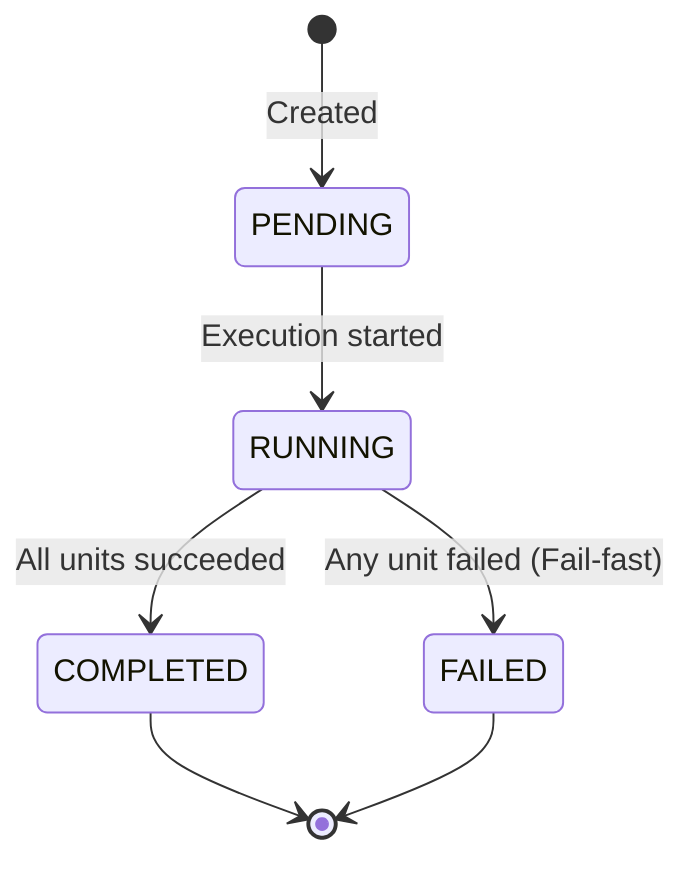

# Execution Plan

An `ExecutionPlan` represents a compiled sequence of executable actions (execution units) that Aether's runtime can perform.

## Purpose

The introduction of `ExecutionPlan` solves a key architectural problem: it separates **planning** (deciding what actions to take) from **execution** (carrying out those actions). 

By establishing a declarative plan:
1.  **Dry-Runs**: The framework can inspect or validate a plan before executing it.
2.  **Introspection**: Developers and parent agents can inspect the execution path of any task.
3.  **LLM Planner Ready**: Future planner modules (e.g. Planning Engine in v0.9.0) will be able to generate plans in a standardized format without coupling themselves to execution details.

> [!NOTE]
> Milestone v0.8.0 does **not** introduce AI/LLM-based planning. The `ExecutionPlan` is generated deterministically by the `ExecutionEngine` based on context. This milestone establishes the necessary data contract and state machine foundation for planning.

## Structure

An `ExecutionPlan` contains:
*   **`units`**: An ordered list of execution units (`SkillUnit` or `ToolUnit`).
*   **`metadata`**: Contextual dictionary (e.g. `task_id`, `agent_name`).
*   **`state`**: The current state of the plan from `ExecutionPlanState`.
*   **`results`**: A list of `UnitExecutionResult` objects accumulated during execution.

## State Machine

The plan lifecycle transitions through the following states:

*   **PENDING**: Initial state upon plan creation.
*   **RUNNING**: The engine is actively executing units in the plan.
*   **COMPLETED**: All units in the plan executed successfully.
*   **FAILED**: Execution aborted early because a unit returned a failed status.

## Future Extensibility

The `ExecutionPlan` design prepares Aether for:
*   **Arbitrary Execution Units**: While v0.8.0 uses `SkillUnit | ToolUnit` explicitly for type safety, the structure will evolve into a generic `ExecutionUnit` protocol, allowing new types of actions (e.g. delegating to another Agent, emitting events, or making external API calls) to be added transparently.
*   **Dynamic Planning**: Future versions will support dynamic replanning, where an agent can modify its `ExecutionPlan` midway through execution if a step fails or yields unexpected output.
