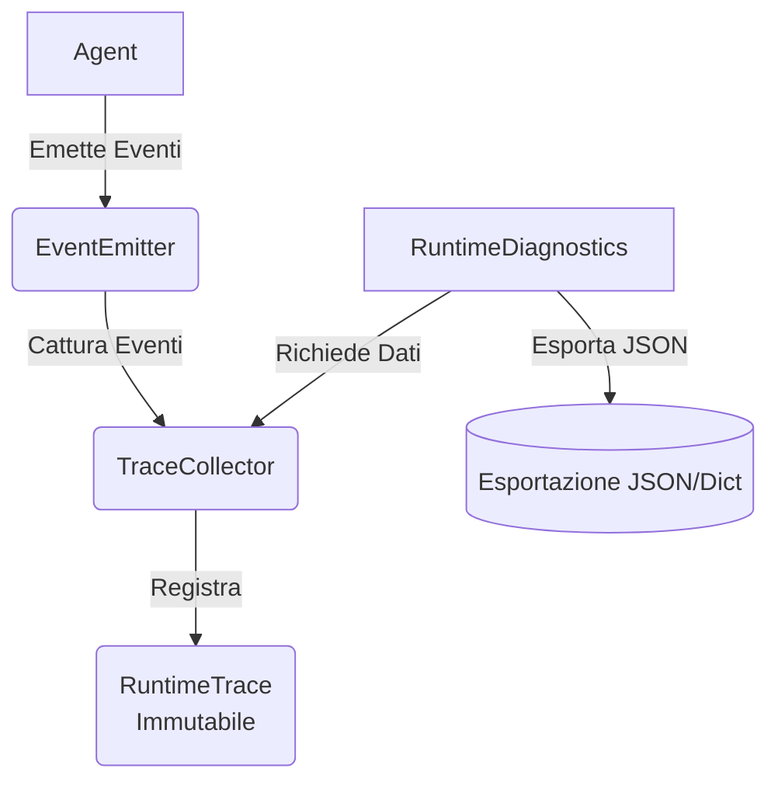

# Architecture Review - v0.15.0 Observability & Runtime Diagnostics

## Obiettivo della Milestone

L'obiettivo della milestone **v0.15.0** è introdurre un sistema di **Osservabilità e Diagnostica** completo e modulare per il framework Aether. Il sistema deve permettere il tracciamento dettagliato dell'esecuzione degli agenti (sia in esecuzione singola che concorrente), mantenendo l'architettura provider-agnostic, local-first, sincrona, priva di dipendenze esterne (es. OpenTelemetry) e retrocompatibile al 100%.

## Stato Attuale (post v0.14.0)

Aether dispone attualmente di:
- Un runtime robusto con memoria persistente ed effimera (v0.11.0).
- Astrazioni per la creazione di tool ed esecuzione multi-agente (v0.12.0).
- Meccanismi di comunicazione (`AgentMessageBus`) e coordinamento (v0.13.0).
- Un `Coordinator` capace di esecuzione parallela con policy di retry e timeout (v0.14.0).

Tuttavia, attualmente **manca un meccanismo nativo** per monitorare nel dettaglio cosa succede internamente durante l'esecuzione:
- Quanto tempo impiega un tool?
- Quanti tentativi (retry) sono scattati per un determinato task?
- Qual è l'albero gerarchico delle deleghe, inclusi i tempi dei sotto-task?
- Qual è il consumo effettivo di token o il tempo speso dal provider AI?

## Principi Architetturali

1. **In-Process & Local First**: Nessuna dipendenza esterna (niente server Jaeger o demoni OpenTelemetry). I dati rimangono in memoria ed esportabili su file.
2. **Nessuna modifica Breaking**: I nuovi componenti saranno opzionali e additivi. I flussi esistenti funzioneranno come prima.
3. **Correlation Tracking**: Ogni evento generato includerà un Correlation ID (es. `trace_id` o `task_id` gerarchico) per collegare azioni padre e azioni figlio.
4. **Isolamento**: Il sistema di logging e tracing non deve bloccare o rallentare il runtime principale.
5. **Provider Agnostic**: Le metriche (token, model, ecc.) devono poter mappare informazioni indipendenti dallo specifico provider utilizzato.
6. **Gestione del Tempo**: Utilizzare rigorosamente `time.perf_counter()` esclusivamente per calcolare durate relative ad alte prestazioni, e `datetime.now(timezone.utc)` esclusivamente per timestamp persistenti assoluti (nessun uso di `datetime.utcnow()`).

## Flusso Architetturale

## Componenti Introdotti

Il nuovo layer verrà posizionato nel package `src/aether/observability/`.

### 1. Modelli Dati (`trace.py`)

- **`TraceEvent`**: Rappresenta il singolo accadimento nel runtime.
  - Attributi: `event_id`, `trace_id`, `task_id` (che funge da span id), `parent_task_id`, `timestamp` (`datetime.now(timezone.utc)`), `event_type`, `component_name`, `metadata`.
  - **`EventType`**: Modello estendibile, non limitato a soli START/END/ERROR. Prevede una classificazione più aperta che permetterà in futuro di differenziare eventi di tool, provider, loop, task, trace ecc., partendo da un design inizialmente minimalista.
- **`ExecutionMetrics`**: Contenitore aggregato per le statistiche.
  - Attributi: `total_duration_ms`, `provider_time_ms`, `tool_time_ms`, `total_tokens`, `retry_count`, `timeout_count`, `error_count`, `successful_tasks`, `failed_tasks`.
- **`RuntimeTrace`**: Contenitore **immutabile** della timeline di una radice di esecuzione, aggregando la storia di `TraceEvent`. Non muta direttamente `ExecutionMetrics`; le metriche verranno derivate o calcolate dinamicamente a partire dagli eventi (es. tramite un `compute_metrics()`). Permette l'esportazione verso dizionario o formato stringa JSON (`to_dict()` e `to_json()`).

### 2. Collettore di Eventi (`collector.py`)

- **`TraceCollector`**: Servizio in-process incaricato di raccogliere i `TraceEvent`.
  - Simile al concetto di Sink o Logger in-memory.
  - Metodi principali: `add_event(event)`, `get_trace(trace_id)`, `remove(trace_id)` (per liberare la memoria al termine di una trace), `clear()`.
  - **Thread-Safety**: Verranno impiegati lock (`threading.Lock`), ma documentando rigorosamente che il lock protegge *solo* le mutazioni della struttura dati e non serializzazioni lunghe o elaborazioni, evitando colli di bottiglia.

### 3. Facciata di Diagnostica (`diagnostics.py`)

- **`RuntimeDiagnostics`**: Classe **istanziabile** (non un singleton globale) che agisce come entry-point.
  - Detiene un riferimento al `TraceCollector`.
  - Potrà agganciarsi dinamicamente all'`EventEmitter` (v0.13.0) o utilizzare un sistema a contesti per raccogliere automaticamente le durate.
  - Sostituisce la necessità di gestire i profiler a mano, offrendo metodi del tipo `export_trace_to_file(trace_id, path)`.

## Interazioni con l'Architettura Esistente

### EventEmitter e Context
Allo stato attuale, abbiamo l'`EventEmitter` che già notifica l'avvio e la fine dei task (`AGENT_STARTED`, `TASK_COMPLETED`, ecc.).
Il `TraceCollector` (o una sua estensione) potrà registrarsi come handler di questi eventi per creare in modo trasparente i `TraceEvent`.

Tuttavia, per tracciare chiamate di più basso livello (es. latenza provider o invocazione di un singolo tool), potremmo sfruttare pattern decoratore, event emission aggiuntivi, oppure estendere l'`AgentContext` opzionalmente per registrare i tempi di esecuzione e accodare i risultati al `TraceCollector`.

Per mantenere la massima retrocompatibilità e il non inquinamento del codice core, l'aggancio avverrà idealmente tramite listener di eventi dove possibile o con minime iniezioni opzionali.

## Risoluzione Ambito/Visibilità (Correlation ID)

Il sistema utilizzerà il **`task_id`** e il **`parent_task_id`** (introdotti nelle milestone precedenti in `DelegationContext` / `AgentMessage`) come unici e naturali identificatori del Correlation ID.
Non verrà introdotto uno `span_id` separato per evitare duplicazioni concettuali. Ogni task radice genererà un nuovo `trace_id`, mentre i task figli erediteranno il `trace_id` e useranno il proprio `task_id` come "span".

## Esportazione

L'esportazione avverrà in formati standard (dizionario Python tramite `to_dict()` e stringa tramite `to_json()`) per favorire integrazioni future con API REST o framework web. Non intendiamo usare formati binari complessi. Un utente dovrà poter chiamare `trace.to_json()` e leggere un albero strutturato della chiamata.
