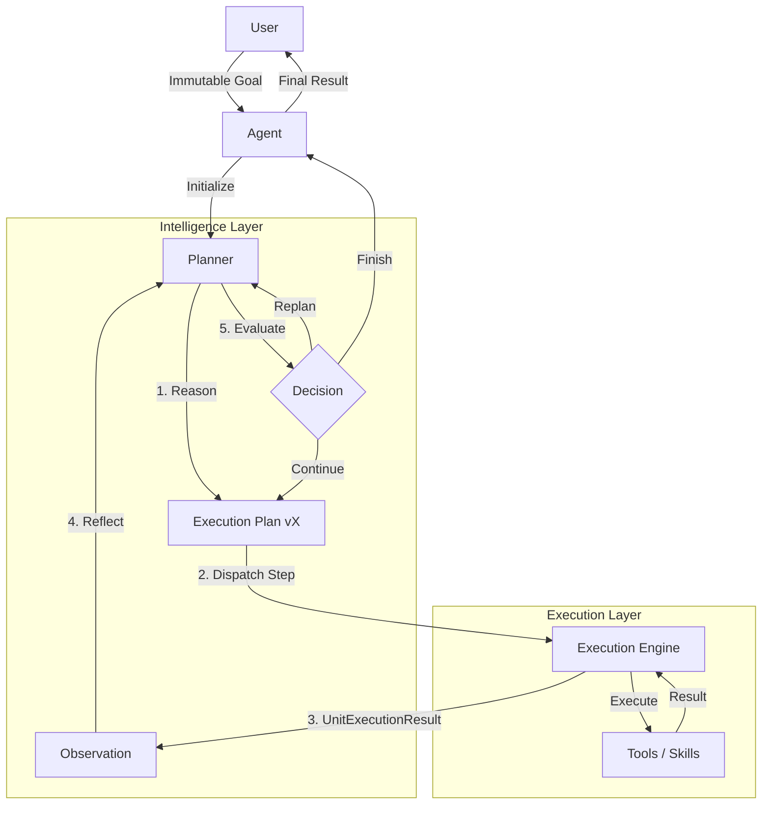

# Aether v0.16.0 - Architecture Review (Definitive)
## Milestone: Agent Intelligence Layer

### 1. Overview & Obiettivi
Lo scopo della milestone v0.16.0 è dotare Aether di un livello decisionale esplicito (Intelligence Layer) astratto dall'`Agent`.
L'obiettivo è separare la meccanica di esecuzione deterministica (`ExecutionEngine`) dal ragionamento di alto livello (planning e reflection), mantenendo la piattaforma *simple*, *production-ready* e rigorosamente *senza over-engineering*.

### 2. Decisioni Architetturali (Revisione Principale)

Durante la fase di design sono state prese posizioni precise su tre pattern chiave per garantire la stabilità di Aether:

1. **Planner Unificato (Rigettata la divisione Reasoner/Planner)**
   * **Decisione**: Il `Planner` si occuperà sia di dedurre la strategia (ragionamento) sia di generare l'`ExecutionPlan`.
   * **Motivazione**: Negli attuali paradigmi LLM (es. ReAct o Tool Calling), il ragionamento ("cosa voglio fare") e la pianificazione ("quale tool chiamo") avvengono all'interno dello stesso contesto generativo. Separare questi concetti in due astrazioni software distinte nella v0.16 implicherebbe chiamate LLM duplicate o inutili acrobazie di context-passing, contravvenendo al principio di *simplicità*. Questa separazione è rimandata a milestone future (es. v0.18 Swarms) qualora si riveli necessaria.

2. **Decision making all'interno del Planner (Rigettato il Decision Engine separato)**
   * **Decisione**: Il `Planner` riceverà l'`Observation` ed emetterà direttamente la `Decision`. Nessun `DecisionEngine` isolato.
   * **Motivazione**: Valutare un risultato (Decision) e generare la contromossa (Replan) richiedono lo stesso identico stato cognitivo. Disaccoppiarli richiederebbe di serializzare lo stato del mondo tra due engine differenti, raddoppiando l'overhead. Il `Planner` gestirà l'intero ciclo cognitivo, mantenendo alta la coesione.

3. **Goal Immutabile (Approvato)**
   * **Decisione**: L'oggetto `Goal` sarà strettamente immutabile. Il Goal non cambierà mai durante l'esecuzione; cambieranno esclusivamente le versioni del piano (`Plan v1 -> Plan v2`).
   * **Motivazione**: Questo pattern protegge il sistema dal *goal drift* (l'agente che abbassa le aspettative pur di terminare). Garantisce massima tracciabilità: possiamo misurare esattamente quanti cicli e replan sono serviti per raggiungere l'intento originale. Qualora il Goal sia impossibile, l'agente lo dichiarerà nel risultato, ma non altererà l'obiettivo originale.

### 3. Responsabilità delle Nuove Componenti
Le componenti introdotte sono additive:

- **`Goal` (Immutabile)**: Astrazione di alto livello dell'intento utente. Contiene `description`, `success_criteria` e `constraints`. Viene creato una volta sola all'inizio e rimane la "stella polare" del processo.
- **`Planner` (Cognitive Layer)**: Il cervello del sistema. Sfrutta il `Provider` per leggere il `Goal` immutabile, valutare le `Observation` e generare un `ExecutionPlan` dinamico o una `Decision`.
- **`Observation`**: Modello dati che traduce l'output freddo dell'`ExecutionEngine` in feedback semantico e digeribile per il Planner.
- **`Decision`**: Il verdetto logico emesso dal Planner in risposta a un'osservazione. Può essere: `CONTINUE` (il piano corrente è valido, procedi al prossimo step), `REPLAN` (ostacolo incontrato, annulla gli step futuri e rigenera il piano), `FINISH` (successo o fallimento definitivo).

### 4. Relazioni e Limiti di Confine
- **`Agent`**: Continua a gestire il Lifecycle e fa da Entrypoint. Instanzia il Planner e delega la gestione del Goal.
- **`ExecutionEngine`**: Non viene modificato in alcun modo. Riceve `Unit` (o piani) ed esegue. Non sa cos'è un Planner o un Goal.
- **`Memory`**: Fornisce contesto al Planner prima del ragionamento.

### 5. Diagramma Architetturale e Data Flow


### 6. Eventuali Nuovi Modelli Dati
I modelli risiederanno nel nuovo modulo logico (es. `aether.planning`):

```python
@dataclass(frozen=True)
class Goal:
    description: str
    success_criteria: tuple[str, ...] = field(default_factory=tuple)
    constraints: tuple[str, ...] = field(default_factory=tuple)

class DecisionAction(str, Enum):
    CONTINUE = "continue"
    REPLAN = "replan"
    FINISH = "finish"

@dataclass
class Decision:
    action: DecisionAction
    reasoning: str

@dataclass(frozen=True)
class Observation:
    action_taken: str
    result: str
    is_error: bool
```

### 7. Roadmap Milestone Successive (v0.17+)
Per preservare la stabilità, il rilascio procede verticalmente:

- **v0.16.0 (Current)**: Intelligence Layer (Planner Unificato, Goal Immutabile).
- **v0.17.0 (Structured Intelligence)**: Adozione di *Structured Outputs* (JSON mode / Pydantic schema) nel layer `Provider`. Questo renderà deterministico il parsing del ragionamento del Planner senza l'uso di euristiche testuali. Separare questa feature dalla v0.16 garantisce di poter testare l'architettura decisionale sui prompt classici senza spaccare le integrazioni provider attuali.
- **v0.18.0 (Autonomous Swarms)**: Possibilità per il Planner di istanziare e delegare a Sub-Agent a runtime (Agent as a Tool). Qui si valuterà se un `Reasoner` separato ha senso per la selezione degli agenti.
- **v0.19.0 (Advanced Memory & RAG)**: Capacità dei Planner di scansionare attivamente grosse moli di testo (Vector Storage nativo).
- **v1.0.0 (Stable Release)**: API e Documentation freeze. Rilascio di produzione.
