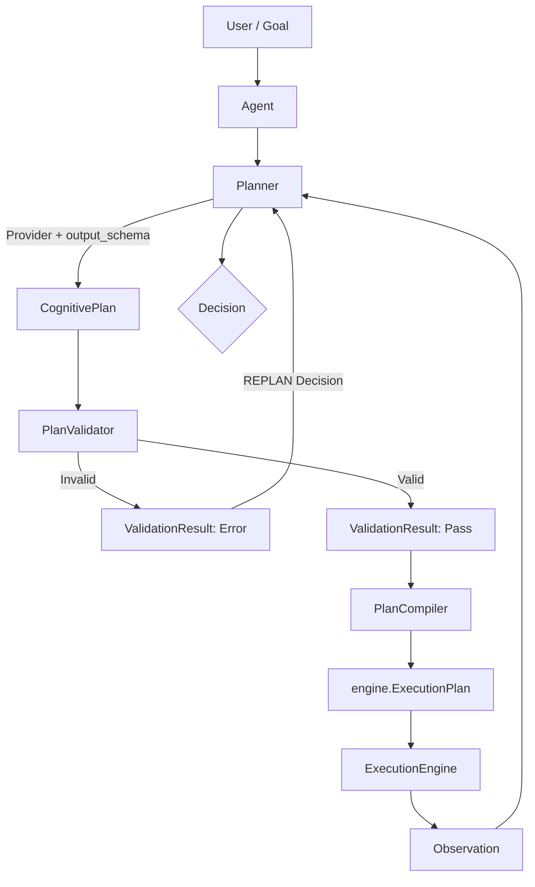

# Aether v0.17.0 - Architecture Review
## Milestone: Structured Intelligence Layer

### 1. Analisi dello stato attuale (v0.16.0)
La milestone v0.16.0 ha introdotto il primo livello cognitivo esplicito per Aether: l'**Agent Intelligence Layer** (costituito da `Goal`, `Planner`, `CognitivePlan`, `PlanCompiler` e `Decision`). L'attuale flusso architetturale è:

`Goal -> Planner -> CognitivePlan -> PlanCompiler -> engine.ExecutionPlan -> ExecutionEngine -> Observation -> Planner -> Decision`

Attualmente, l'integrazione con l'LLM (Provider) si basa interamente su generazione testuale o tool calling base. Il `Planner` analizza gli output in modo euristico (text parsing). Questa opacità rende i ragionamenti complessi difficili da validare in modo deterministico e inclini a errori. L'`ExecutionEngine` rimane intatto e isolato dalla logica cognitiva.

### 2. Problema che risolve v0.17.0
L'obiettivo primario della v0.17.0 è l'introduzione dello **Structured Intelligence Layer**, garantendo che:
- La comunicazione cognitiva diventi deterministica introducendo API per **Structured Outputs** nativi nel Provider.
- Aether diventi consapevole delle capacità del modello (es. vision, structured_output) tramite un **Provider Capability System**.
- Si definisca un percorso chiaro per l'evoluzione dei **Planner** (`ReAct`, `Plan-and-Solve`).
- Venga introdotto un livello opzionale di **Validation** per i piani generati, per bloccare "allucinazioni logiche" (es. chiamare un tool inesistente o infrangere un vincolo) **prima** di interagire col runtime.

### 3. Structured Output Layer

#### A. Structured Output API
La firma di `AIProvider.generate()` verrà estesa per accettare un parametro generico `output_schema`. Non si legherà Aether esplicitamente a Pydantic a livello di core API.
```python
def generate(
    self, 
    messages: list[Message], 
    tools: list[dict] | None = None,
    output_schema: Any | None = None
) -> ProviderResponse:
```
- Il `Planner` richiederà lo schema desiderato.
- Il `Provider` deciderà come implementarlo (es. mappando un modello Pydantic su `response_format={"type": "json_schema"}` per OpenAI o iniettando un JSON Schema nel system prompt per modelli fallback).

#### B. ProviderCapabilities
Aether introdurrà un sistema esplicito e immutabile per conoscere le capacità del modello in uso, tramite un modello `@dataclass`.
- Il Provider esporrà `@property capabilities(self) -> ProviderCapabilities`.
- Il framework eviterà controlli imperativi (`isinstance(provider, OllamaProvider)`) mantenendo un design provider-agnostic.
- **Fallback Strategy**: Se `provider.capabilities.structured_output` è `False`, il Planner o il Provider potranno iniettare istruzioni testuali nel prompt e parsare l'output manualmente.

### 4. Planner Evolution
Il modulo `aether.planning.planner` verrà espanso senza creare gerarchie profonde (no God-Classes).
- `BasePlanner (ABC)`: Contratto puro (generate_plan, evaluate).
- `BasicPlanner`: (Attuale) Generazione di piani a singolo step testuale.
- `ReActPlanner`: Ciclo ricorsivo *Thought-Action-Observation*. Genera un `CognitivePlan` contenente l'intenzione immediata (un singolo step), e innescherà iterativamente le riflessioni in base all'`Observation`.
- `PlanAndSolvePlanner`: Planner di tipo "waterfall", genererà un `CognitivePlan` multi-step upfront, demandando al compiler l'esecuzione in batch.

### 5. Validation Architecture
Verrà introdotto un `PlanValidator(ABC)` posizionato logicamente tra `Planner` e `PlanCompiler`. Questo componente esegue una validazione "fail-fast" *prima* che l'intento cognitivo arrivi all'engine.

**Flusso Architetturale Aggiornato:**

Se il piano non supera la validazione (es. violazione constraints, tool inesistente), il Validator emette un `ValidationResult` fallito. Il Planner usa questo risultato per intraprendere immediatamente una `Decision` (es. `REPLAN`), cortocircuitando l'accesso al Compiler e all'Engine.

### 6. Modelli Dati Proposti

```python
# In aether.providers.capabilities
@dataclass(frozen=True)
class ProviderCapabilities:
    tools: bool = False
    vision: bool = False
    structured_output: bool = False
    thinking: bool = False

# In aether.planning.validation
@dataclass(frozen=True)
class ValidationResult:
    is_valid: bool
    errors: tuple[str, ...] = ()
```

### 7. Alternative Scartate
- **`response_model` dipendente da Pydantic nel core**: Scartato in favore di un `output_schema` agnostico per garantire la flessibilità futura (TypedDict, JSON Schema nudo, o validatori custom).
- **`capabilities` come dizionario (dict)**: Scartato per evitare stringhe arbitrarie. Una `@dataclass(frozen=True)` fornisce autocompletamento IDE, type safety e stabilità delle API.
- **Validator che emette un'Observation**: Scartato. Un'Observation rappresenta l'esito di un'azione nel mondo reale (ExecutionEngine). Il Validator agisce *prima* del runtime. Generare un'Observation fittizia sporcherebbe la purezza semantica; il `ValidationResult` è concettualmente distinto e notifica direttamente il Planner di un errore di ragionamento.
- **JSON mode obbligatorio**: Scartato. Romperebbe la retrocompatibilità per provider minori o per LLM open-source leggeri. Lo structured output sarà opzionale e protetto da feature flag e fallback (system prompt).

### 8. Rischi Tecnici
1. **Divergenza di Schema tra Modelli**: Non tutti i modelli locali supportano output JSON o schemi complessi (es. Llama.cpp fallback). **Mitigazione**: Il framework manterrà il graceful fallback via prompting.
2. **Overhead Computazionale**: La serializzazione degli schemi in input/output porta con sé un lieve penalty prestazionale. Aether v0.17 è comunque pensato per mitigarlo delegando il grosso del lavoro ai provider SDK (es. OpenAI).
3. **Differenze tra Provider API**: Mantenere un layer agnostico (`output_schema`) richiede che il Provider (es. Ollama vs OpenAI) sia robusto nell'interpretare schemi misti. 

### 9. Piano Implementativo Futuro (v0.17.0)
1. **Fase 1 (Foundation)**: Aggiungere `ProviderCapabilities` immutabile ai provider.
2. **Fase 2 (Provider Update)**: Introdurre il parametro generico `output_schema` in `AIProvider` base (con eventuali parsing mapping per OpenAI e Ollama).
3. **Fase 3 (Validation)**: Creare il modulo `aether.planning.validation`, definendo `ValidationResult` immutabile e l'interfaccia `PlanValidator(ABC)`.
4. **Fase 4 (Planner Evolution)**: Estendere i Planner base per adottare facoltativamente il tipaggio logico.
5. **Fase 5 (Agent Orchestration)**: Aggiornare `Agent.achieve()` per includere il controllo `ValidationResult` nel workflow prima di interpellare il `PlanCompiler`.
